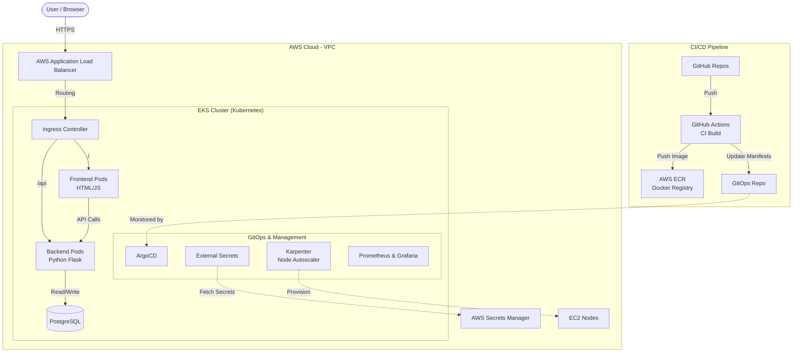

# ספר פרויקט גמר - DevOps: DogOps

**מוגש על ידי:** [הכנס שם מלא]
**תעודת זהות:** [הכנס ת.ז]
**מכללה:** אורט סינגאלובסקי
**מגמה:** DevOps
**שם המנחה:** [הכנס שם מנחה]

---

## תוכן עניינים
1. [הצהרת סטודנטים](#הצהרת-סטודנטים)
2. [מבוא לפרויקט](#מבוא-לפרויקט)
3. [מטרת המערכת והאפליקציה](#מטרת-המערכת-והאפליקציה)
4. [ארכיטקטורת המערכת](#ארכיטקטורת-המערכת)
5. [הסבר על כל כלי](#הסבר-על-כל-כלי)
6. [תהליך העבודה (GitFlow) ו-CI/CD Pipeline](#תהליך-העבודה-ו-cicd-pipeline)
7. [Terraform - Infrastructure as Code](#terraform---infrastructure-as-code)
8. [Docker - קונטיינריזציה](#docker---קונטיינריזציה)
9. [Kubernetes ו-GitOps](#kubernetes-ו-gitops)
10. [ניטור (Monitoring) ו-Observability](#ניטור-monitoring-ו-observability)
11. [בעיות צפויות ופתרונות](#בעיות-צפויות-ופתרונות)
12. [תמונות קוד (Code Snippets) וצילומי מסך](#תמונות-קוד-וצילומי-מסך)
13. [סיכום אישי](#סיכום-אישי)

---

## הצהרת סטודנטים
אני החתום מטה, מצהיר בזאת כי כל פרויקט הגמר המוגש בספר זה, הינו פרי עבודתי בלבד, על בסיס הנחייתו של המנחה ותוך הסתמכות על מקורות הידע והמידע האחרים המצויים בביבליוגרפיה המובאת בסיום ספר זה. אני מודע לאחריות שאני מקבל על עצמי ע"י חתימתי על הצהרה זאת, שכל הנאמר בה הינה אמת ורק אמת.

**חתימה:** _________________

---

## מבוא לפרויקט
תחום ה-DevOps (Development & Operations) הוא תרבות וגישה טכנולוגית שנועדה לגשר על הפערים ההיסטוריים בין צוותי הפיתוח לצוותי התפעול (IT). בעבר, מפתחים היו כותבים קוד ו"זורקים" אותו לצוותי התפעול כדי שיפרסו אותו בשרתים (Deployment). תהליך זה היה איטי, מועד לטעויות, וגרם לחיכוך רב. 

פרויקט זה מציג פתרון מקיף וקצה-לקצה (End-to-End) המיישם את עקרונות ה-DevOps הלכה למעשה. הפרויקט מדגים כיצד ניתן לקחת אפליקציה המורכבת ממספר שכבות (Microservices) ולבצע אוטומציה מלאה משלב כתיבת הקוד, דרך בדיקות, אריזה, יצירת תשתיות ענן, ועד לפריסה שקופה, בטוחה וניתנת לניטור בסביבת Production.

---

## מטרת המערכת והאפליקציה
מטרת הפרויקט היא להקים סביבת ענן מודרנית ואוטומטית עבור אפליקציית **DogOps**. 
מדובר באפליקציה בעלת ארכיטקטורת 3-Tier קלאסית:
1. **Frontend (צד לקוח):** ממשק משתמש הכתוב ב-HTML, CSS ו-JavaScript נקי (Vanilla). השכבה הזו אחראית על הנגשת האפליקציה למשתמשי הקצה.
2. **Backend (צד שרת):** מנוע האפליקציה הכתוב בשפת Python (באמצעות ספריית Flask). שרת זה מטפל בלוגיקה העסקית, מנהל את ממשקי ה-API ומקשר בין צד הלקוח לבסיס הנתונים.
3. **Database (בסיס נתונים):** בסיס נתונים מסוג PostgreSQL המשמש לשמירת המידע בצורה רלציונית, בטוחה ושרידה.

**המטרות הטכנולוגיות של הפרויקט:**
* **אוטומציה מלאה (CI/CD):** כל שינוי קוד (Push) מפעיל שרשרת אוטומטית של בנייה, בדיקה ופריסה.
* **תשתית כקוד (IaC):** הקמה של כל סביבת ה-AWS (רשתות, הרשאות, קלאסטר EKS) באמצעות קוד ללא התערבות ידנית בממשק המשתמש של אמזון.
* **GitOps:** ניהול מצב הקלאסטר מתוך מאגר Git, כך שהקלאסטר מושך (Pull) את השינויים אוטומטית ומסנכרן את עצמו.
* **גמישות ועמידות (High Availability):** יכולת לגדול ולקטון אוטומטית (Autoscaling) באמצעות כלים מתקדמים כמו Karpenter.

---

## ארכיטקטורת המערכת
הארכיטקטורה מבוססת לחלוטין על שירותי הענן של AWS ועל סביבת Kubernetes.



---

## הסבר על כל כלי

### 1. AWS (Amazon Web Services)
ספקית הענן המובילה בעולם שעליה מתארח הפרויקט. בפרויקט נעשה שימוש ב:
* **VPC:** ניהול הרשת הפרטית, Subnets ציבוריים ופרטיים, נתבים (NAT/IGW).
* **EKS (Elastic Kubernetes Service):** שירות ניהול הקלאסטר של קוברנטיס.
* **S3:** אחסון אובייקטים (כגון קבצי ה-State של Terraform).
* **IAM / IRSA:** ניהול הרשאות מאובטח למשאבים ולפודים.

### 2. Docker
כלי לאריזת האפליקציה והתלויות שלה לתוך "קונטיינרים" (Containers). בניגוד למכונה וירטואלית (VM) שמכילה מערכת הפעלה שלמה, קונטיינר משתמש בליבה (Kernel) של המארח, מה שהופך אותו לקל משקל, מהיר ועקבי בין סביבות ("עובד אצלי, יעבוד בכל מקום").

### 3. Kubernetes (K8s)
מערכת קוד פתוח לתזמור (Orchestration) וניהול של אלפי קונטיינרים. אחראית על:
* התאוששות מאסון (Self-healing - פוד שנופל מוקם מחדש).
* חלוקת עומסים (Load Balancing).
* חשיפת שירותים והגדרת כמות רפליקות (Scaling).

### 4. Terraform
כלי ליצירת תשתיות כקוד (Infrastructure as Code). מאפשר לכתוב קוד הצהרתי (Declarative) בשפת HCL המתאר את התשתית הרצויה, ו-Terraform דואג להקים אותה ב-AWS בצורה מדויקת, עקבית וניתנת לשחזור ולמעקב גרסאות.

### 5. GitHub Actions
שירות CI/CD המובנה בתוך GitHub. מאפשר ליצור "צינורות תהליך" (Pipelines) אוטומטיים המריצים סקריפטים ופעולות בכל פעם שמפתחים דוחפים (Push) קוד חדש.

### 6. ArgoCD (GitOps)
כלי Continuous Delivery לקוברנטיס המיישם את גישת ה-GitOps. ArgoCD מאזין למאגר גיט שמכיל את קבצי התצורה של קוברנטיס (Manifests/Helm), וברגע שהוא מזהה שינוי (למשל, עדכון גרסת אימג'), הוא מסנכרן (Sync) אוטומטית את הקלאסטר למצב הרצוי המוגדר בקוד.

### 7. כלים מתקדמים (Karpenter & External Secrets)
* **Karpenter:** פרויקט קוד פתוח של AWS שנועד לשפר את הגמישות של קוברנטיס. הוא מזהה פודים שממתינים לשרת (Pending) ומקים עבורם תוך שניות שרתי EC2 בגדלים מדויקים ובעלות אופטימלית, במקום להשתמש ב-Node Groups סטטיים. זהו כלי מתקדם מאוד המבטיח ניצולת משאבים מושלמת.
* **External Secrets Operator (ESO):** במקום לשמור סיסמאות בקבצי הקוד, מערכת זו מושכת סודות (כמו סיסמאות ל-DB או לממשקי API) ישירות מ-AWS Secrets Manager ומזריקה אותם לקלאסטר בצורה מאובטחת.

---

## תהליך העבודה ו-CI/CD Pipeline

בפרויקט יושמה מתודולוגיית עבודה מבוססת **GitFlow** וניהול 3 מאגרים מופרדים (Repositories):
1. **`devops-dogops-app`**: מכיל את קוד המקור של האפליקציה (Frontend, Backend) ואת קבצי ה-Helm Charts.
2. **`devops-dogops-infra`**: מכיל את קוד ה-Terraform שמקים את תשתית הענן.
3. **`devops-dogops-gitops`**: מכיל את תצורת הסביבות (Environments - Prod, Staging, Test) ואת הגדרות ה-ArgoCD.

### זרימת ה-CI/CD המלאה (The Pipeline)
כאשר מפתח מבצע `git push` לענף הראשי במאגר האפליקציה, מופעל ה-Pipeline הבא (דרך GitHub Actions):

1. **Linting & Testing:** הקוד נבדק אל מול תקני כתיבה (למשל `pylint` ל-Python) כדי לוודא שאין שגיאות תחביר.
2. **Docker Build:** המערכת בונה שני קונטיינרים (Images) - אחד עבור ה-Frontend ואחד עבור ה-Backend.
3. **Push to Registry:** האימג'ים נדחפים למאגר התמונות המאובטח של אמזון (Amazon ECR) ומתויגים במספר בנייה (Tag / Commit SHA).
4. **Update GitOps Repo:** סקריפט אוטומטי עושה Checkout למאגר ה-GitOps, מעדכן שם את קובץ ה-`values.yaml` של הסביבה הרלוונטית עם ה-Tag החדש שנוצר, ומבצע אליו Commit.
5. **ArgoCD Sync:** רכיב ה-ArgoCD שרץ בתוך הקלאסטר מזהה שינוי במאגר ה-GitOps. הוא משווה את המצב הנוכחי למצב הרצוי, ומתחיל תהליך פריסה אוטומטי וזהיר (Rolling Update) שמחליף את הפודים הישנים בחדשים מבלי לפגוע בזמינות האפליקציה.

---

## Terraform - Infrastructure as Code

התשתית כולה מנוהלת דרך תיקיית המודולים והסביבות של Terraform. 
במקום לייצר משאבים ידנית ב-AWS Management Console, יצרנו מודול תשתית אחיד שניתן לשכפל לסביבות שונות (Dev, Staging, Prod).

**ניהול ה-State:**
קובץ ה-State של טרפורם מכיל את מיפוי המשאבים הקיים מול הקוד. כדי לאפשר עבודת צוות, ה-State בפרויקט נשמר מרחוק ב-**S3 Bucket**, עם מנגנון נעילה (Locking) המנוהל דרך DynamoDB.

**מודולים מרכזיים בפרויקט:**
* **VPC Module:** שימוש במודול הרשמי של קהילת Terraform ליצירת רשת עם Private/Public Subnets, NAT Gateways ו-Route Tables.
* **EKS Module:** הקמת הקלאסטר עצמו, ניהול תעודות, והגדרת הרשאות הגישה.
* **Helm Provider:** בתוך ה-Terraform הוגדרו "Helm Releases" אשר מתקינים אוטומטית שירותי תשתית על הקלאסטר מיד עם הקמתו: אינגרס קונטרולר, ArgoCD, כלי ניטור (Prometheus), וניהול סודות (ESO).

**דוגמה מקוד ה-Terraform (סביבת Prod):**
```hcl
module "infrastructure" {
  source = "../../modules/infrastructure"

  environment        = "prod"
  vpc_cidr           = "10.3.0.0/16"
  node_instance_type = "t3.medium"

  domain_name        = "dogops.co"
}
```

---

## Docker - קונטיינריזציה

לכל רכיב באפליקציה יש `Dockerfile` משלו. הקפדנו על עקרונות Best Practices בבניית תמונות Docker, כגון שימוש ב-Multi-stage builds כדי להקטין את נפח האימג' הסופי ולשפר את רמת האבטחה (ריצה ללא הרשאות root).

**דוגמה ל-Dockerfile של ה-Backend (Python/Flask):**
```dockerfile
# Stage 1: Build dependencies
FROM python:3.11-slim as builder
WORKDIR /app
COPY requirements.txt .
RUN pip install --user -r requirements.txt

# Stage 2: Final minimal image
FROM python:3.11-slim
WORKDIR /app
COPY --from=builder /root/.local /root/.local
COPY . .
ENV PATH=/root/.local/bin:$PATH
# Run as non-root user for security
RUN useradd -m appuser && chown -R appuser /app
USER appuser

EXPOSE 5000
CMD ["flask", "run", "--host=0.0.0.0"]
```

---

## Kubernetes ו-GitOps

### המבנה בקוברנטיס
* **Deployments:** כל רכיב (Frontend, Backend) מנוהל על ידי Deployment שמוודא שכמות הפודים המוגדרת (Replicas) פועלת תמיד.
* **Services:** חשיפה פנימית של הפודים. ה-Frontend מקבל תעבורה מה-Ingress, וה-Backend מקבל תעבורה רק מה-Frontend (שמירה על אבטחה).
* **Ingress:** שער הכניסה של האפליקציה (AWS ALB), המנתב את תעבורת ה-HTTP/HTTPS מהעולם החיצון לתוך הקלאסטר על בסיס נתיבים (Path-based routing).
* **Helm Charts:** האפליקציה נארזה לתוך תבניות Helm המאפשרות להזריק פרמטרים שונים (כמו כתובת מסד הנתונים או גרסת האימג') לכל סביבה בנפרד.

### GitOps באמצעות ArgoCD ApplicationSets
אחד האלמנטים המתקדמים בפרויקט הוא השימוש ב-**ApplicationSets** לניהול סביבות מרובות (Multi-Tenant). במקום ליצור ידנית הגדרה ב-ArgoCD עבור כל סביבה ואפליקציה, נכתב קובץ תבנית אחד (`root-app-multi-tenant.yaml`) שסורק את תיקיית ה-`environments` בגיט ומייצר דינמית את האפליקציות עבור Test, Staging ו-Prod. 
כל סביבה נפרסת בצורה מבודדת ל-Namespace נפרד על גבי קלאסטר יחיד, מה שחוסך בעלויות תשתיות ענן (חיסכון בהקמת 3 קלאסטרים נפרדים) ומאפשר ניהול פשוט וחכם מנקודה מרכזית אחת (Single Pane of Glass).

---

## ניטור (Monitoring) ו-Observability

לא מספיק שהאפליקציה פועלת; צריך לדעת מה קורה בה בזמן אמת.
בפרויקט הותקן הסטאק המלא של **Kube-Prometheus-Stack**:
* **Prometheus:** סורק (Scrape) אוטומטית מטריקות מהקלאסטר, מהשרתים ומהפודים, ושומר אותם במסד נתונים של סדרות-זמן (Time-series).
* **Grafana:** מערכת ויזואליזציה המציגה דאשבורדים יפהפיים. דרכה ניתן לראות צריכת CPU, זיכרון, כמות שגיאות בשרת (500/404) וזמני תגובה.
* **התראות (Alerting):** הוגדרו התראות קריטיות (למשל, כאשר פודים נכנסים למעגל קריסות - CrashLoopBackOff) שעוזרות לצוות לזהות תקלות לפני שהלקוחות מרגישים בהן.

---

## בעיות צפויות ופתרונות

במהלך הפיתוח נתקלנו במספר אתגרים טכנולוגיים אותם פתרנו באמצעות כלים מתקדמים:

1. **בעיה - ניהול סודות מאובטח (Secrets Management):**
   * **האתגר:** שמירת סיסמאות מסד הנתונים או מפתחות API בקבצי הגיט מהווה חור אבטחה חמור. שימוש ב-Secret רגיל של קוברנטיס דורש התערבות ידנית או קידוד ב-Base64 שאינו מוצפן באמת.
   * **הפתרון:** הטמעת **External Secrets Operator**. יצרנו את הסודות פעם אחת ב-AWS Secrets Manager. הרכיב שרץ בקלאסטר קורא את הסודות ישירות מאמזון ומייצר דינמית את ה-K8s Secrets בתוך הקלאסטר. כך הקוד נשאר נקי ובטוח לחלוטין.

2. **בעיה - התאמת כמות השרתים לעומס בצורה יעילה:**
   * **האתגר:** Cluster Autoscaler קלאסי יכול להיות איטי, ודורש ניהול מורכב של Node Groups לכל סוג שרת (t3.medium, m5.large וכו').
   * **הפתרון:** שימוש ב-**Karpenter**. כלי שפותח על ידי AWS שיודע "להסתכל" על הצרכים של הפודים שעומדים בתור, ולקנות באופן ישיר ומיידי שרת בדיוק בגודל המתאים ישירות מה-EC2 API. זה הוזיל עלויות והגביר את מהירות ההתאוששות בעומסים כבדים.

3. **בעיה - הרשאות ענן מאובטחות (Least Privilege):**
   * **האתגר:** מתן הרשאות AWS לפוד מסוים (כמו אפשרות לכתוב לקובץ ב-S3 או לקרוא מ-Secrets Manager) דרך מתן הרשאות ל-Node כולו חושפת פודים אחרים לאותן הרשאות.
   * **הפתרון:** שימוש ב-**IRSA (IAM Roles for Service Accounts)**. קישור ספציפי של תפקיד IAM מ-AWS ל-ServiceAccount ייעודי בקוברנטיס. כך רק פוד ה-Backend, למשל, מורשה לגשת למסד הנתונים או לסודות הרלוונטיים לו.

4. **בעיה - ניהול סביבות מרובות (Multi-Tenancy) ביעילות:**
   * **האתגר:** הקמת קלאסטר EKS נפרד לכל סביבה (Test, Staging, Prod) דורשת עלויות תחזוקה גבוהות וזמן הקמה ארוך (כ-20 דקות לכל קלאסטר).
   * **הפתרון:** יישום גישת **Multi-Tenant (Soft Isolation)**. הקמנו קלאסטר EKS מרכזי אחד עליו רצות כל הסביבות, כאשר ההפרדה ביניהן מתבצעת ברמת ה-Namespaces בקוברנטיס. ArgoCD מנטר את ה-ApplicationSet ופורס כל סביבה ב-Namespace ייעודי, מה שמוזיל עלויות דרמטית ומאפשר ניהול מרוכז.

5. **בעיה - אובדן הרשאות גישה לקלאסטר (EKS Auth Conflict):**
   * **האתגר:** במהלך יצירת התשתית מחדש, ה-IAM Role שהריץ את Terraform איבד את הרשאות ה-Admin לקלאסטר בשל שינוי הגדרות מחדל במודול של AWS (מבוסס Access Entries החדש).
   * **הפתרון:** ביצוע התערבות חירום ממוקדת באמצעות ה-AWS CLI ליצירה ידנית של `EKS Access Entry` עבור משתמש ה-Terraform, ולאחר מכן ביצוע `terragrunt import` כדי לייבא את המשאבים חזרה ל-State של טרפורם מבלי להרוס ולבנות את הקלאסטר מחדש. פתרון זה הדגים יכולת פתרון תקלות (Troubleshooting) מתקדמת בסביבת ייצור חיה.

---

## תמונות קוד וצילומי מסך

*[הערה: כאן תשלב בצילומי המסך הסופיים של הפרויקט כשתגיש את המסמך למרצה]*

### 1. ריצת GitHub Actions (CI)
*(הכנס צילום מסך של ריצה ירוקה ב-GitHub Actions המראה בנייה ו-Push ל-ECR)*

### 2. ממשק ArgoCD
*(הכנס צילום מסך של ממשק ה-ArgoCD מציג את עץ המשאבים הירוק והמסונכרן של אפליקציית prod-journai או dogops)*

### 3. דאשבורד Grafana
*(הכנס צילום מסך של גרפנה מציג צריכת זיכרון ו-CPU של הקלאסטר)*

### 4. דוגמה מקוד ה-GitHub Actions:
```yaml
name: App CI

on:
  push:
    branches: [ "main" ]

jobs:
  build-and-push:
    runs-on: ubuntu-latest
    steps:
    - uses: actions/checkout@v3
    
    - name: Login to Amazon ECR
      uses: aws-actions/amazon-ecr-login@v1
      
    - name: Build, tag, and push image
      run: |
        docker build -t $ECR_REGISTRY/dogops-backend:${{ github.sha }} ./backend
        docker push $ECR_REGISTRY/dogops-backend:${{ github.sha }}
```

---

## סיכום אישי

*[הערה: פרק זה נועד לכתיבה אישית שלך. להלן טיוטה להשראה שתוכל לערוך ולהתאים לעצמך]*

פרויקט זה היווה עבורי קפיצת מדרגה משמעותית בהבנה ויישום של תהליכי DevOps מודרניים. המעבר מלמידה תיאורטית של כלים נפרדים, לאינטגרציה מלאה של כולם יחד לכדי מערכת חיה, פועלת ונושמת בענן, היה מאתגר ומרתק כאחד.

למדתי כיצד מתמודדים עם תקלות בזמן אמת, כיצד מגדירים תשתיות בצורה מדויקת באמצעות קוד (Terraform), ואת החשיבות העצומה של גישת ה-GitOps באמצעות ArgoCD שהופכת את מאגר הגיט למקור האמת היחיד של המערכת (Single Source of Truth). הכלים המתקדמים ששילבתי בפרויקט, כגון Karpenter לניהול שרתים ו-External Secrets לאבטחת מידע, הוכיחו לי עד כמה האקו-סיסטם של Kubernetes הוא עוצמתי ומתרחב.

אני מסיים את הפרויקט בתחושת סיפוק רבה, עם ביטחון ביכולתי לתכנן, להקים ולנהל ארכיטקטורות ענן ו-CI/CD בסביבות עבודה מודרניות בשוק ההייטק.

---
**סוף הספר.**
